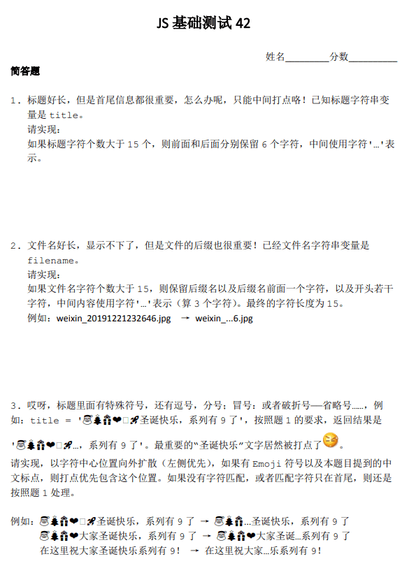

# JS 基础测试 42 期

## [题目](https://github.com/zhangxinxu/quiz/issues/58)



题目出现字符：`title = '🎅🎄🎁❤️🚀圣诞快乐，系列有9了'`

## 解答

```js
let longtext = `test_1577433499884.txt`;
let title = "🎅🎄🎁❤️🚀圣诞快乐，系列有9了";
console.log("\n longtext--->", longtext.length); // 22

/* 第一题 */
let res1 = longtext.replace(longtext.slice(6, -6), "...");
console.log("\n res1--->", res1); // test_1...84.txt

/* 第二题 */
let filename, suffix;
[filename = "", suffix = ""] = longtext.split(".");
let end = "." + suffix;
let len = 15 - end.length - 3; // 除 ...x.suffix 字符长度
let start = filename.replace(filename.slice(len - 1, -1), "...");
let res2 = start + end;
console.log("\n res2--->", res2); // test_15...4.txt

/* 第三题 */
```
